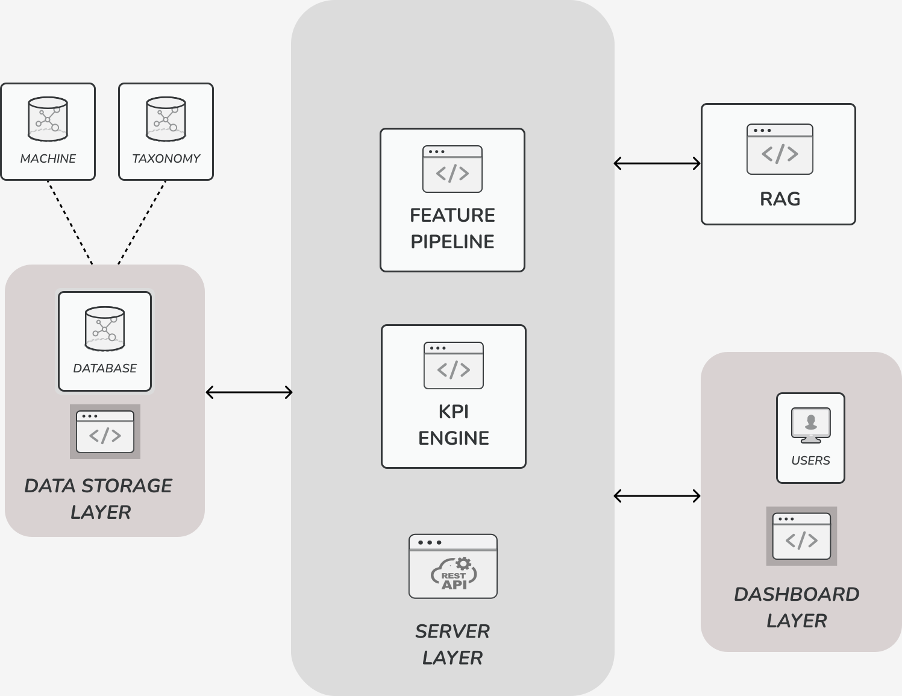

# RESTful API for Industry 5.0
This repository contains the code for the RESTful API for Industry 5.0 and is part of the Smart Application Course Project at UNIPI A.Y. 2024/25. The API is built using FastAPI and implements all the necessary endpoints to interact with the Industry 5.0 system.

## System Description
The Industry 5.0 system is a smart manufacturing system that integrates the latest technologies to optimize the production process. The system is composed of several machines that are connected to a central server. The server collects data from the machines and processes it to provide insights and key performance indicators (KPIs) to the users. The users can interact with the system through a web interface or a mobile application to monitor the production process, analyze the data, and make informed decisions. A RAG (Retrieval-Augmented Generation) model is used to generate informative and actionable insights from the data collected by the machines. A feature pipeline is used to extract features from the raw data and feed them into the RAG model to generate the insights. The insights are then presented to the users through the web interface or the mobile application. A KPI engine is used to calculate the KPIs based on the data collected by the machines and provide them to the users. The KPIs are used to evaluate the performance of the production process and identify areas for improvement.

## Design
The API is designed following the RESTful principles and uses FastAPI to implement the endpoints. The API is organized in plugins, each containing a set of endpoints related to a specific functionality. The plugins are modular and can be easily extended or modified to add new features or change the existing ones. The API uses Pydantic models to define the request and response formats for the endpoints and provides automatic validation and serialization of the data. The API documentation is generated automatically from the code and provides information about the available endpoints, request and response formats, and examples.

<p align="center">
	
</p>

All the system components communicate through the API Layer, that ensure consistency and security of the data exchanged.
## Installation
To install the API, clone the repository and install the dependencies using pip:
```bash
git clone https://github.com/sa-team-d/api.git
cd api
pip install -r requirements.txt
```

## Usage
To start the API locally, run the following command:
```bash
uvicorn main:app --reload
```
or use the FastAPI command for development:
```bash
fastapi dev main.py
```
The API will be available at `http://localhost:8000`.

## Documentation

The API documentation is available at `http://localhost:8000/docs` as a Swagger UI interface. The documentation provides information about the available endpoints, request and response formats, and examples. For an alternative view, the API documentation is also available at `http://localhost:8000/redoc`.

## Plugins
The API is organized in plugins, each containing a set of endpoints related to a specific functionality. The available plugins are:
- `kpi`: Key Performance Indicators
- `machine`: Machines
- `user`: Users
- `TODO`: Add new plugins

## Contact
For any questions or issues, please contact the project maintainers:
- [Leonardo Stoppani](https://github.com/lilf4p)
- [Oleksiy](https://github.com/lesi-nedo)

